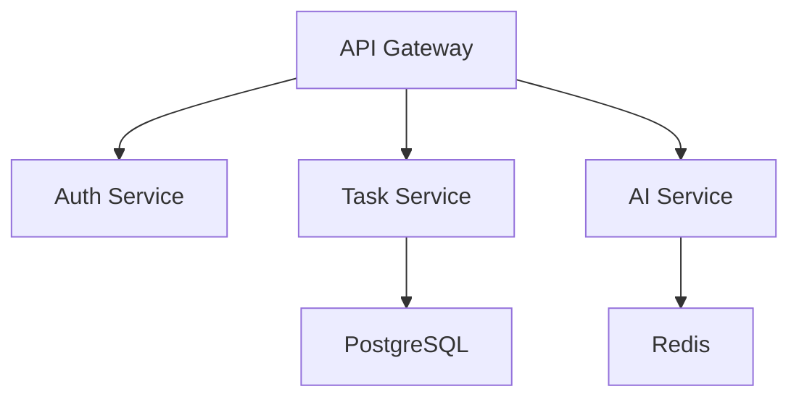

# AI-DLC 実行例

## 例 1: タスク管理アプリの立ち上げ

### ステップ 1: 戦略立案

**入力:**

```
@strategy-agent 新規プロジェクトの戦略立案

プロジェクト名: TeamFlow
解決したい課題: スタートアップのタスク管理が煩雑で、進捗が見えにくい
ターゲット: 10-50人規模のスタートアップ
競合: Asana, Trello, Linear
```

**出力:** `docs/strategy/teamflow-strategy.md`

主要内容:

-   Mission: チームの生産性を最大化する
-   NSM: 週次アクティブチーム数
-   TAM: 10 億円規模
-   差別化: AI 自動優先順位付け

### ステップ 2: PRD 自動生成

**自動実行（Hook 経由）**

**出力:** `docs/prd/teamflow-prd.md`

主要機能:

-   REQ-01: タスク作成・編集（Must）
-   REQ-02: AI 優先順位付け（Must）
-   REQ-03: チーム共有（Should）
-   REQ-04: レポート生成（Could）

### ステップ 3: バックログ自動生成

**自動実行（Hook 経由）**

**出力:**

-   `docs/backlog/teamflow-backlog.md`
-   `docs/pbi/teamflow-pbi.json`

生成されたエピック:

1. ユーザー認証（13SP）
2. タスク管理（21SP）
3. AI 優先順位付け（13SP）
4. チーム機能（8SP）

### ステップ 4: Notion 自動登録

**自動実行（Hook 経由）**

Notion に登録:

-   プロジェクト: TeamFlow
-   エピック: 4 件
-   PBI: 23 件

---

## 例 2: 週次データ分析

### 実行

Hook "📊 週次データ分析"を実行

### 出力

`docs/analysis/2026-02-03-weekly-analysis.md`

```markdown
# 週次分析レポート

## KPI サマリー

-   WAU: 1,250 (+8.7% WoW)
-   継続率: 68% (-2% WoW) ⚠️
-   タスク完了率: 72% (+5% WoW)

## インサイト

1. 新規ユーザーの継続率が低下

    - 原因仮説: オンボーディングの離脱
    - 改善案: チュートリアル改善

2. タスク完了率が向上
    - 要因: AI 優先順位付け機能の効果

## 改善 PBI

-   PBI-024: オンボーディングチュートリアル改善（8SP, High）
```

### 自動アクション

改善 PBI がバックログに追加され、Notion に登録

---

## 例 3: ソースコード解析

### 実行

```
@architect-agent https://github.com/team/teamflow-backend を解析
```

### 出力

`docs/specs/teamflow-tech-spec.md`

````markdown
# 技術仕様書: TeamFlow Backend

## アーキテクチャ


````

## 技術スタック

-   Node.js 18
-   Express 4.18
-   PostgreSQL 15
-   Redis 7

## コード品質

-   Cyclomatic Complexity: 平均 8.2
-   テストカバレッジ: 67%
-   重複コード: 3.2%

## 技術的負債

1. 認証ミドルウェアのリファクタリング（High）
2. テストカバレッジ向上（Medium）
3. API レスポンス最適化（Medium）

```

### 自動アクション

技術的負債PBIがバックログに追加:
- PBI-025: 認証ミドルウェアリファクタリング（5SP, High）
- PBI-026: テストカバレッジ80%達成（8SP, Medium）

---

## 例4: 突発タスク追加

### 実行

Hook "➕ 突発タスク追加"を実行

**入力:**
```

タイトル: ログイン時のタイムアウトエラー修正
説明: ユーザーがログイン時に頻繁にタイムアウトエラーが発生
タイプ: Bug
緊急度: Critical

````

### 処理

1. ストーリーポイント見積もり: 3SP
2. 優先順位判定: 最優先
3. 依存関係確認: なし
4. バックログ挿入: 最上位

### 出力

```json
{
  "id": "PBI-027",
  "type": "Bug",
  "title": "ログイン時のタイムアウトエラー修正",
  "priority": "Critical",
  "storyPoints": 3,
  "status": "To Do",
  "sprint": "Sprint 3"
}
````

### 警告

```
⚠️ スプリント影響分析
現在のSprint 3の容量: 21SP
追加後の容量: 24SP
推奨: 低優先度タスク1件を次スプリントに移動
```

---

## 例 5: 月次戦略レビュー

### 実行

Hook "🎯 月次戦略レビュー"を実行

### Phase 1: データ分析

```markdown
## 1 月の振り返り

### KPI 達成状況

-   WAU 目標: 1,500 → 実績: 1,280 (85%)
-   継続率目標: 70% → 実績: 66% (94%)
-   NPS 目標: 50 → 実績: 48 (96%)

### 主要インサイト

1. 新規獲得は順調だが、継続率が課題
2. AI 機能の満足度が高い（NPS +15pt）
3. チーム機能の利用率が低い（30%）
```

### Phase 2: 戦略評価

```markdown
## 戦略の有効性

### 継続する施策

-   AI 優先順位付け機能の強化
-   個人ユーザー向けマーケティング

### 見直す施策

-   チーム機能のポジショニング
    → 個人ユーザーからチームへの転換施策を強化

### 新規施策

-   オンボーディング改善プログラム
-   リテンション向上施策
```

### Phase 3: ドキュメント更新

-   戦略ドキュメント更新
-   PRD に新機能追加
-   バックログ再優先順位付け

### 出力

`docs/review/2026-02-01-monthly-review.md`

---

## チャットコマンド一覧

### 戦略立案

```
@strategy-agent [プロジェクト名]の戦略を立案
```

### PRD 作成

```
@prd-agent [戦略ドキュメント]からPRDを作成
```

### バックログ生成

```
@backlog-agent [PRD]からバックログを生成
```

### データ分析

```
@analyst-agent 週次/月次データ分析を実行
```

### ソース解析

```
@architect-agent [リポジトリURL]を解析
```

### タスク追加

```
@backlog-agent 突発タスクを追加
[タスク詳細]
```

### Notion 同期

```
@integration-agent Notionに同期
```
