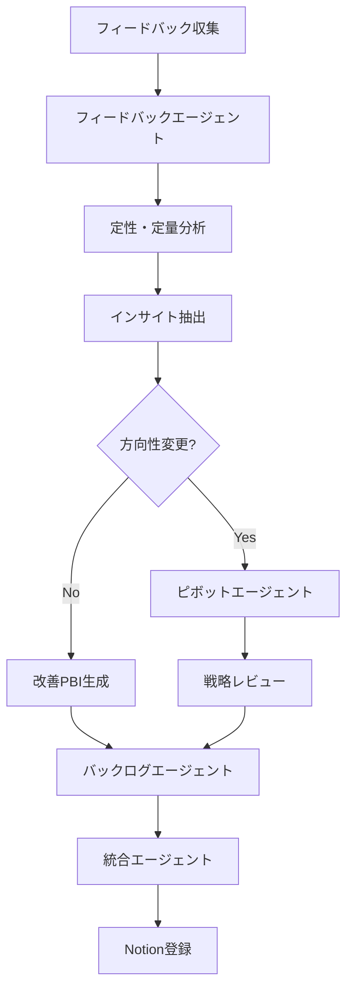

# フィードバックループ自動化

既存プロジェクトのフィードバックを自動的に分析し、改善PBIを生成するフローです。

## 概要

ユーザーフィードバック → 分析 → 改善提案 → PBI生成 → バックログ追加 → Notion登録までを自動化します。

## フィードバックソース

### 1. ユーザーアンケート

- 保存先: `docs/feedback/surveys/`
- フォーマット: CSV, JSON, Markdown

### 2. アプリ内フィードバック

- 保存先: `docs/feedback/in-app/`

### 3. カスタマーサポート

- 保存先: `docs/feedback/support/`

### 4. レビュー・コメント

- App Store/Google Play
- SNS上の言及
- 保存先: `docs/feedback/reviews/`

### 5. ユーザーインタビュー

- 保存先: `docs/feedback/interviews/`

## 自動化フロー

## 使い方

### 手動実行

1. フィードバックファイルを `docs/feedback/` に配置
2. Hook "📝 フィードバック分析"を実行
3. 生成されたPBIを確認

### 自動実行

`docs/feedback/` にファイルを追加すると自動的に分析が実行されます。

## 出力

### 1. フィードバック分析レポート

`docs/feedback/{date}-feedback-analysis.md`

- Executive Summary
- 感情分析結果
- トピック別分析
- ペインポイントTOP5
- 要望TOP5
- インサイト

### 2. 改善PBI

`docs/pbi/{date}-feedback-pbi.json`

- ユーザーの声に基づくPBI
- 優先順位付き
- 期待効果の定量化

### 3. 方向性変更アラート（必要時）

`docs/feedback/{date}-direction-change-alert.md`

## ピボット評価

方向性変更が検知された場合、ピボットエージェントが起動します。

### ピボット検知条件

1. **ユーザーフィードバックベース**
    - 現在の機能への不満が60%以上
    - 想定外の使われ方が主流
    - ターゲットユーザーが想定と異なる

2. **データベース**
    - KPI達成率が3ヶ月連続で50%未満
    - ユーザー継続率が急激に低下（-20%以上）

3. **市場環境ベース**
    - 競合が圧倒的な優位性を確立
    - 新たな市場機会の発見

4. **ビジネスモデルベース**
    - 収益化が困難
    - Unit Economicsが成立しない

### ピボット評価プロセス

1. 現状分析
2. ピボット案の立案（複数）
3. 評価マトリクスで評価
4. 推奨案の選定
5. 移行計画の策定

## 既存プロジェクトの取り込み

### オンボーディングフロー

1. Hook "🔗 既存プロジェクトオンボーディング"を実行
2. プロジェクト情報を入力
3. 自動的に以下を生成：
    - 戦略ドキュメント
    - PRD
    - バックログ
    - 技術仕様書（リポジトリがある場合）
4. Notionに登録

### 必要な情報

- プロジェクト名
- 現在のステータス
- リポジトリURL（オプション）
- 解決している課題
- ターゲットユーザー
- 主要機能
- 現在のKPI

## ベストプラクティス

### フィードバック収集

1. **定期的な収集**: 週次でフィードバックを収集
2. **構造化**: 可能な限り構造化されたフォーマットで保存
3. **メタデータ**: ユーザーセグメント、日付、ソースを記録

### 分析頻度

- **リアルタイム**: Critical/Highの緊急度
- **週次**: 通常のフィードバック
- **月次**: 総合的な分析とピボット評価

### PBI生成基準

- 同じ要望が5件以上
- 感情スコアが-0.5以下（ネガティブ）
- Critical/Highの緊急度

## トラブルシューティング

### フィードバックが分析されない

1. ファイル形式を確認（CSV, JSON, Markdown）
2. `docs/feedback/` 配下に配置されているか確認
3. 手動で "📝 フィードバック分析"を実行

### PBIが生成されない

1. フィードバック件数が閾値（5件）を超えているか確認
2. 優先度が十分に高いか確認
3. 分析レポートを確認

### ピボット評価が起動しない

1. 方向性変更の検知条件を満たしているか確認
2. 手動で "🔄 ピボット評価"を実行
3. 分析データが十分にあるか確認
