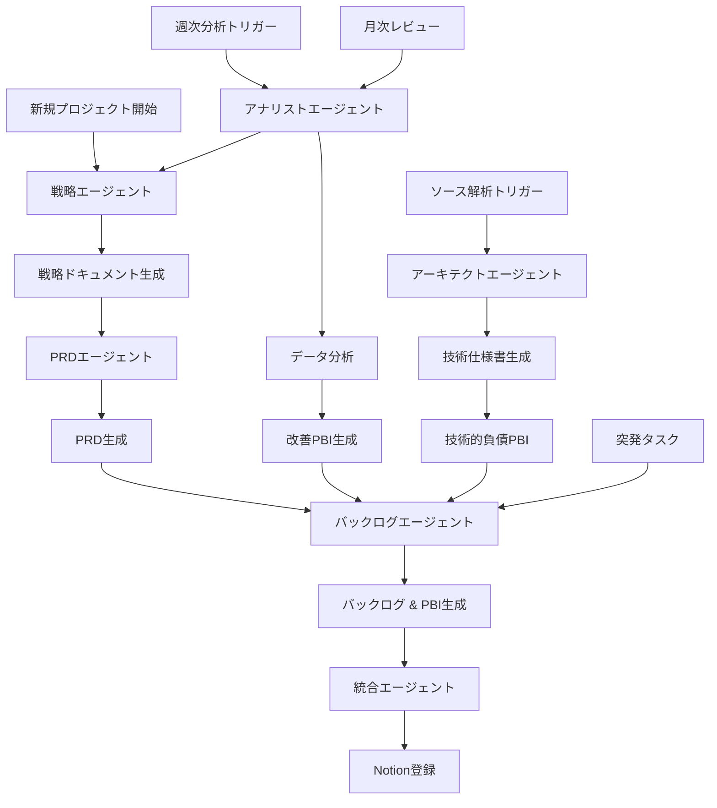
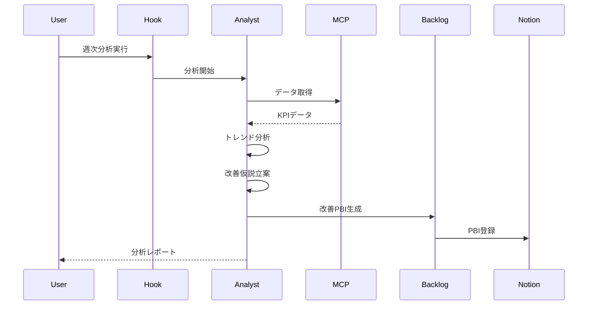
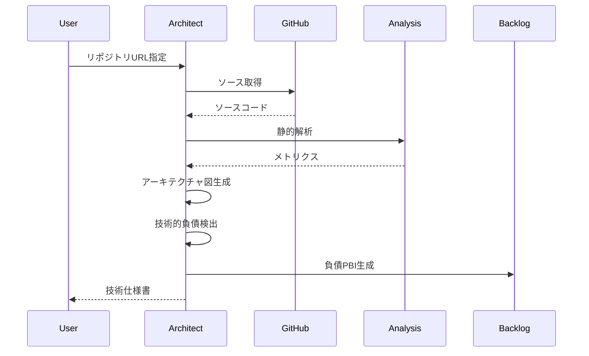
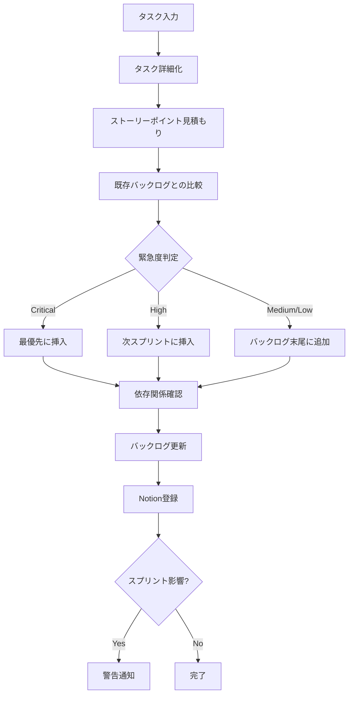
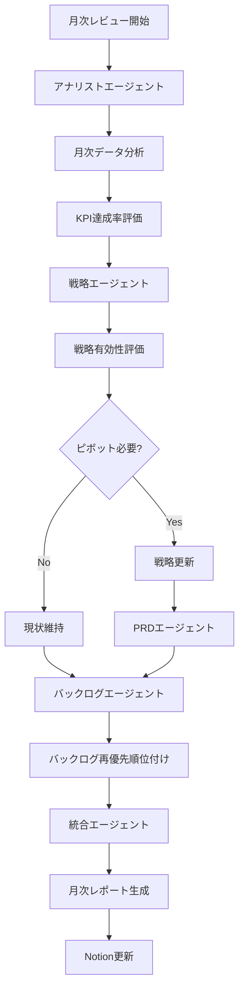

# AI-DLC ワークフロー詳細

## 全体フロー図



## 1. 新規プロジェクト立ち上げフロー

### Phase 1: 戦略立案（Strategy Agent）

**入力:**

-   プロジェクト概要
-   解決したい課題
-   ターゲット顧客
-   市場情報

**処理:**

1. 4 階層フレームワークに基づく対話
    - Layer 1: Core (Mission/Vision)
    - Layer 2: Why (Market/Persona)
    - Layer 3: What (Experience/Economics)
    - Layer 4: How (Execution)
2. MECE 思考による論点整理
3. フェルミ推定による市場規模算出
4. KGI/KPI 設定

**出力:**

-   `docs/strategy/{project-name}-strategy.md`
-   KGI/KPI 定義
-   市場機会分析
-   競争優位性

**自動トリガー:** PRD エージェント起動

---

### Phase 2: PRD 作成（PRD Agent）

**入力:**

-   戦略ドキュメント
-   技術制約（あれば）

**処理:**

1. 戦略から機能要件への変換
2. 優先度付け（MoSCoW 法）
3. ユーザーフロー設計
4. 受け入れ基準定義
5. 非機能要件の明確化

**出力:**

-   `docs/prd/{project-name}-prd.md`
    -   Executive Summary
    -   Functional Requirements（表形式）
    -   Non-Functional Requirements
    -   UI/Screens
    -   Go To Market Strategy

**自動トリガー:** バックログエージェント起動

---

### Phase 3: バックログ生成（Backlog Agent）

**入力:**

-   PRD ドキュメント
-   チームベロシティ（あれば）

**処理:**

1. PRD をエピックに分解
2. エピックをユーザーストーリーに分解
3. ユーザーストーリーをタスクに分解
4. ストーリーポイント見積もり
5. 優先順位付け
6. 依存関係の整理

**出力:**

-   `docs/backlog/{project-name}-backlog.md`
-   `docs/pbi/{project-name}-pbi.json`

**バックログ構造:**

```
エピック: ユーザー認証機能
├── US-001: ユーザーとして、メールアドレスでログインしたい（5SP）
│   ├── TASK-001: ログインフォームUI作成（2h）
│   ├── TASK-002: 認証API実装（4h）
│   └── TASK-003: セッション管理実装（3h）
├── US-002: ユーザーとして、パスワードをリセットしたい（3SP）
│   └── ...
```

**自動トリガー:** 統合エージェント起動

---

### Phase 4: Notion 登録（Integration Agent）

**入力:**

-   PBI JSON
-   プロダクトバックログ

**処理:**

1. Notion プロジェクトデータベースに登録
2. Notion エピックデータベースに登録
3. Notion PBI データベースに登録
4. リレーション設定
5. 登録完了レポート生成

**出力:**

-   Notion データベース更新
-   登録完了レポート

---

## 2. 週次データ分析フロー

### トリガー

-   手動実行: Hook "📊 週次データ分析"
-   定期実行: 毎週月曜日 9:00（設定可能）

### 処理フロー



### 分析内容

1. **KPI トレンド分析**

    - 過去 4 週間の推移
    - 前週比・前月比
    - 目標達成率

2. **セグメント分析**

    - ユーザー属性別
    - 行動パターン別
    - コホート分析

3. **ファネル分析**

    - 各ステップの転換率
    - ドロップオフポイント特定

4. **異常検知**

    - 急激な変化の検出
    - アラート発行

5. **改善提案**
    - データドリブンな仮説
    - 優先順位付き施策案
    - 期待効果の定量化

### 出力

-   `docs/analysis/{date}-weekly-analysis.md`
-   `docs/pbi/{date}-improvement-pbi.json`
-   Notion への自動登録

---

## 3. ソースコード解析フロー

### トリガー

-   手動実行: Hook "🔍 ソースコード解析"
-   新規リポジトリ追加時
-   大規模リファクタリング前

### 処理フロー



### 解析内容

1. **アーキテクチャ解析**

    - コンポーネント構成
    - 依存関係
    - データフロー

2. **コード品質メトリクス**

    - Cyclomatic Complexity
    - 重複コード率
    - テストカバレッジ

3. **技術的負債検出**

    - セキュリティ脆弱性
    - パフォーマンスボトルネック
    - 保守性の問題

4. **API 仕様抽出**
    - エンドポイント一覧
    - リクエスト/レスポンス形式
    - 認証方式

### 出力

-   `docs/specs/{project-name}-tech-spec.md`
-   `docs/analysis/{project-name}-code-analysis.md`
-   `docs/pbi/{date}-tech-debt-pbi.json`
-   アーキテクチャ図（Mermaid）

---

## 4. 突発タスク追加フロー

### トリガー

-   手動実行: Hook "➕ 突発タスク追加"
-   チャットから直接入力

### 処理フロー



### 入力フォーマット

```
タイトル: 〇〇機能の緊急修正
説明: ユーザーが〇〇できない問題が発生
タイプ: Bug
緊急度: Critical
影響範囲: 全ユーザー
```

### 自動判定

1. **ストーリーポイント見積もり**

    - 類似タスクとの比較
    - 複雑度分析

2. **優先順位判定**

    - 緊急度
    - 影響範囲
    - ビジネス価値
    - 技術的依存関係

3. **スプリント影響分析**
    - 現在のスプリント容量
    - 他タスクへの影響
    - リスク評価

---

## 5. 月次戦略レビューフロー

### トリガー

-   手動実行: Hook "🎯 月次戦略レビュー"
-   定期実行: 毎月 1 日 10:00

### 処理フロー



### レビュー内容

1. **データ分析**

    - 過去 1 ヶ月の KPI 推移
    - 目標達成率
    - ユーザー行動の変化

2. **戦略評価**

    - 仮説の検証結果
    - 市場環境の変化
    - 競合動向

3. **意思決定**

    - 戦略継続 or ピボット
    - 次月の重点施策
    - リソース配分

4. **ドキュメント更新**
    - 戦略ドキュメント
    - PRD
    - バックログ

### 出力

-   `docs/review/{date}-monthly-review.md`
-   更新された戦略・PRD・バックログ
-   次月アクションプラン

---

## エージェント連携マトリクス

| エージェント | 戦略 | PRD | バックログ | アナリスト | アーキテクト | 統合 |
| :----------- | :--: | :-: | :--------: | :--------: | :----------: | :--: |
| 戦略         |  -   |  →  |     -      |     ←      |      -       |  →   |
| PRD          |  ←   |  -  |     →      |     -      |      ←       |  →   |
| バックログ   |  -   |  ←  |     -      |     ←      |      ←       |  →   |
| アナリスト   |  →   |  -  |     →      |     -      |      -       |  →   |
| アーキテクト |  -   |  →  |     →      |     -      |      -       |  →   |
| 統合         |  ←   |  ←  |     ←      |     ←      |      ←       |  -   |

-   →: データを渡す
-   ←: データを受け取る

---

## カスタマイズポイント

### 1. 分析頻度の変更

`.kiro/hooks/05-weekly-analysis.md`のトリガー設定を変更

### 2. 優先順位ルールの調整

`.kiro/agents/backlog-agent.md`の見積もり基準を変更

### 3. Notion データベース構造の変更

`.kiro/agents/integration-agent.md`のデータベース構造定義を変更

### 4. 新しいワークフローの追加

新しい Hook とエージェントを作成して連携
