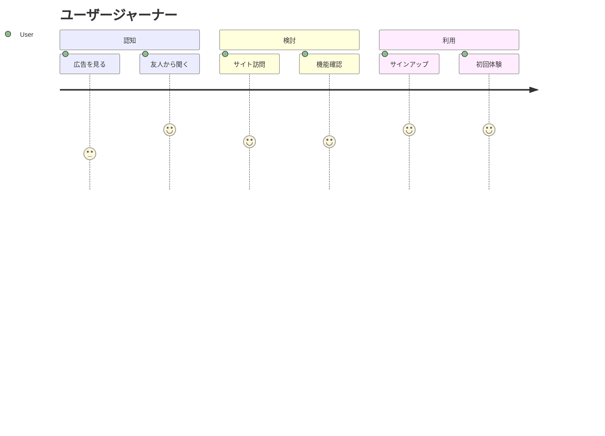

# 戦略ドキュメント: {プロジェクト名}

作成日: {日付}
作成者: Strategy Agent

---

## 1. Executive Summary

### Mission

{このプロジェクトが解決する最大の「不」}

### Vision

{3 年後の理想的な状態}

### 北極星指標（NSM）

{最も重要な 1 つの指標}

---

## 2. Layer 1: Core (Philosophy & Strategy)

### Why Now?

{なぜ今、このプロダクトが必要か}

### Moat（競争優位性）

{他社が簡単に真似できない強み}

### Golden Circle

-   **Why**: {存在理由}
-   **How**: {実現方法}
-   **What**: {提供価値}

---

## 3. Layer 2: Why (Market & User Psychology)

### Target Persona

| 項目       | 内容               |
| :--------- | :----------------- |
| 名前       | {ペルソナ名}       |
| 年齢・職業 | {基本属性}         |
| ペイン     | {解決したい課題}   |
| ゲイン     | {得たい価値}       |
| JTBD       | {達成したいジョブ} |

### Market Size

-   **TAM**: {Total Addressable Market}
-   **SAM**: {Serviceable Available Market}
-   **SOM**: {Serviceable Obtainable Market}

### Value Proposition

{競合に対する圧倒的な優位性}

---

## 4. Layer 3: What (Experience & Economics)

### User Journey



### Business Model

-   **収益モデル**: {サブスク/広告/手数料等}
-   **単価**: {価格設定}
-   **Unit Economics**:
    -   LTV: {顧客生涯価値}
    -   CAC: {顧客獲得コスト}
    -   LTV/CAC 比: {3 以上が理想}

### Hook Model（習慣化）

1. **Trigger**: {きっかけ}
2. **Action**: {行動}
3. **Reward**: {報酬}
4. **Investment**: {投資}

---

## 5. Layer 4: How (Execution & Feasibility)

### MVP Scope

{最小限で価値を提供できる機能}

### Roadmap

| フェーズ | 期間   | 主要機能 | 目標  |
| :------- | :----- | :------- | :---- |
| Phase 1  | {期間} | {機能}   | {KPI} |
| Phase 2  | {期間} | {機能}   | {KPI} |
| Phase 3  | {期間} | {機能}   | {KPI} |

### Risk Matrix

| リスク     | 影響度 | 発生確率 | 対策   |
| :--------- | :----- | :------- | :----- |
| {リスク 1} | High   | Medium   | {対策} |

---

## 6. KGI/KPI 定義

### KGI（最終目標）

{3 ヶ月後/6 ヶ月後/1 年後の数値目標}

### KPI（先行指標）

| KPI    | 現状     | 目標     | 測定方法   |
| :----- | :------- | :------- | :--------- |
| {KPI1} | {現状値} | {目標値} | {測定方法} |

### KPI 構造（因数分解）

```
KGI = KPI1 × KPI2 × KPI3
```

---

## 7. 仮説と検証プラン

### 主要仮説

1. **仮説 1（抽象）**: {構造的な仮説}
    - **仮説 1（具体）**: {具体的な行動仮説}

### 検証プラン

| 仮説   | 検証方法    | 期間   | 成功基準 |
| :----- | :---------- | :----- | :------- |
| {仮説} | {定量/定性} | {期間} | {基準}   |

---

## 8. Go To Market Strategy

### Seeding Strategy

{最初の 100 人をどう集めるか}

### Growth Loops

{ユーザーがユーザーを呼ぶ仕組み}

### チャネル戦略

| チャネル   | 優先度            | 施策     | 期待効果 |
| :--------- | :---------------- | :------- | :------- |
| {チャネル} | {High/Medium/Low} | {具体策} | {効果}   |

---

## 9. 競合分析

### 競合マップ

| 競合     | 強み   | 弱み   | 差別化ポイント |
| :------- | :----- | :----- | :------------- |
| {競合 A} | {強み} | {弱み} | {差別化}       |

---

## 10. 次のアクション

1. {アクション 1}
2. {アクション 2}
3. {アクション 3}
